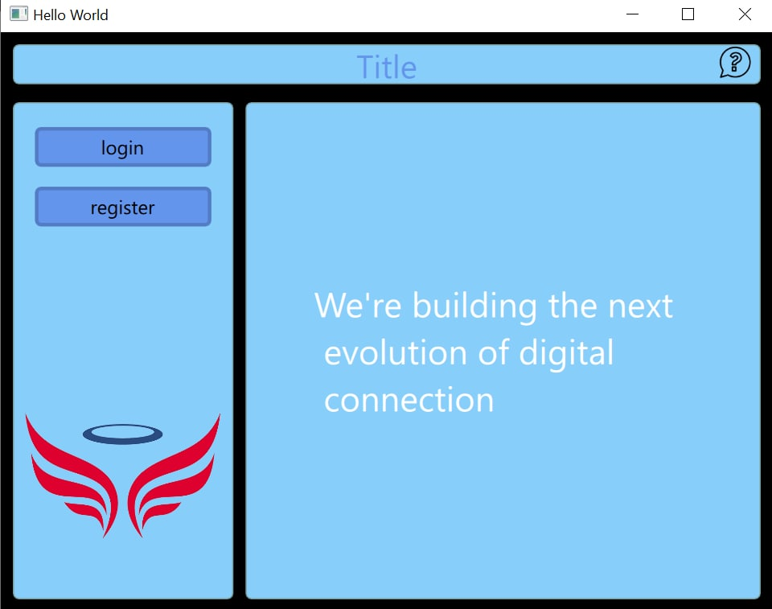
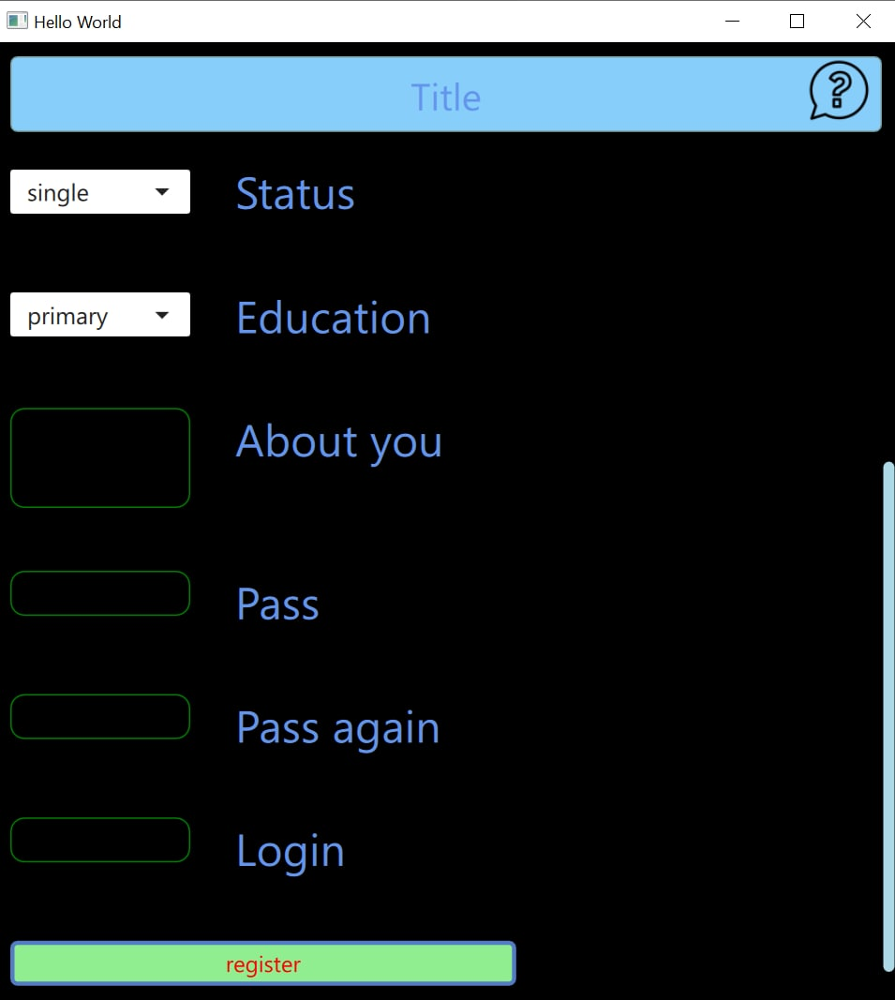
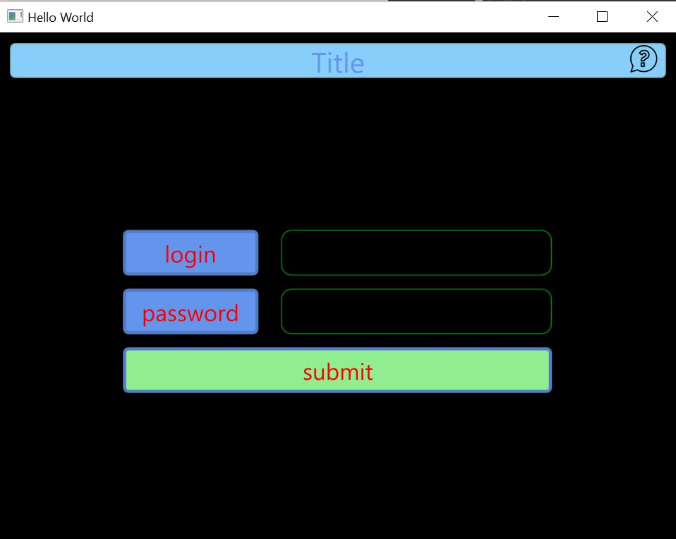
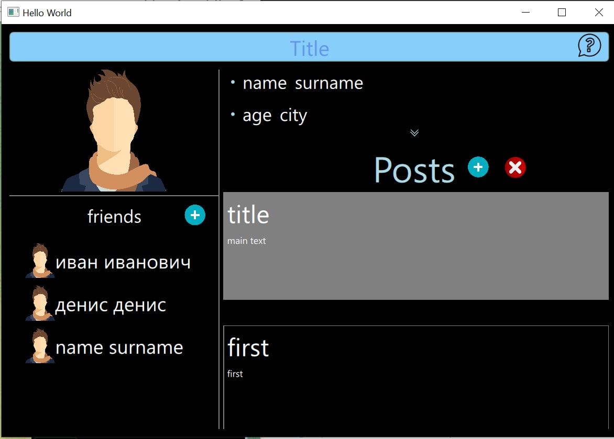

## prototype of social network
---
> Qt
> 
> C++
> 
> QML
> 
> PostgreSQL
---
table of persons   

| id  | login | password |
| ------------- | ------------- | ------------- |
| content  | content  |content  |

and posts table

| id  | id_person | maintext | title |
| ------------- | ------------- | ------------- | ------------- |
| content  | content  |content  |content  |

---
* login(login password in db)
* register(only login and password in db)
*  posts (posts in db)

friend and about person (not in db)!

 ---

  |  
:-------------------------:|:-------------------------:
  |  

---
